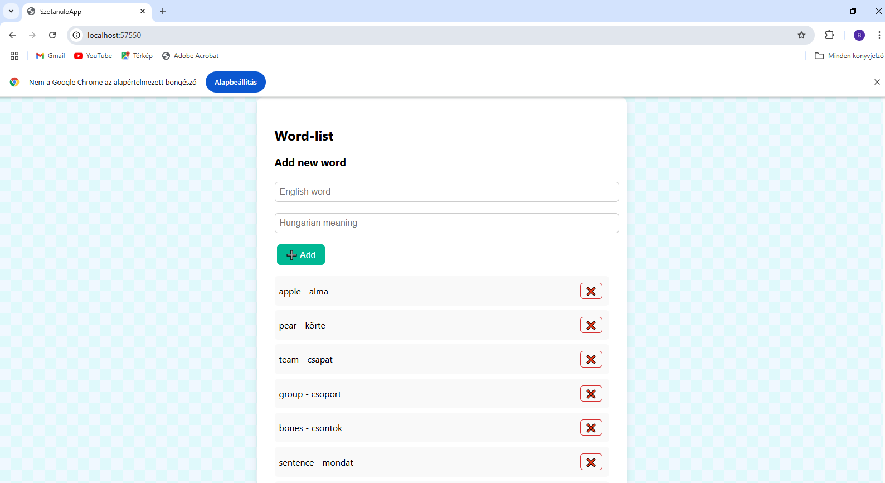
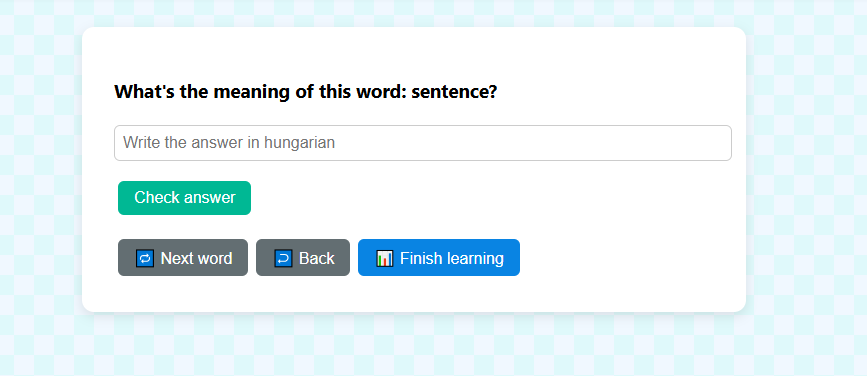
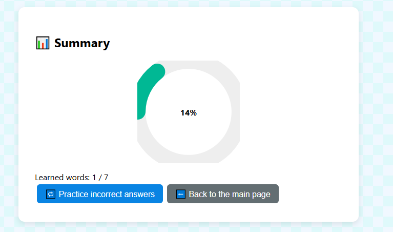

# Vocabulary Learning App (English-Hungarian)

A simple yet stylish single-page application (SPA) built with **F#** and **WebSharper**. The app is designed for learning English words with their Hungarian meanings, testing knowledge through quizzes, and tracking progress visually.

---

## Features

- Add new words (English–Hungarian pairs)
- Delete words
- Start a quiz (type in the Hungarian meaning)
- Visual statistics with a progress circle
- Retry quiz with incorrect answers only

---

## 📸 Screenshots

| Word List | Quiz | Statistics |
|-----------|------|------------|
|  |  |  |


---

## Try Live Link:

 [Live Demo](https://bence999999999.github.io/project_omega_F_sharp/)

---

## Build & Run

### Requirements

- [.NET SDK](https://dotnet.microsoft.com/download) (Recommended: .NET 8 or newer)
- [WebSharper](https://websharper.com)

### Build the project

```bash
dotnet build

### Run Locally
navigate to the folder of your project then -> dotnet run
